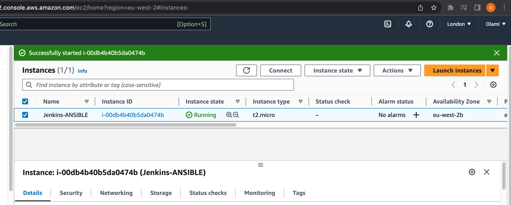
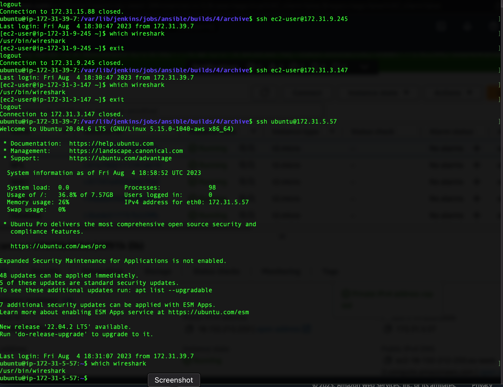
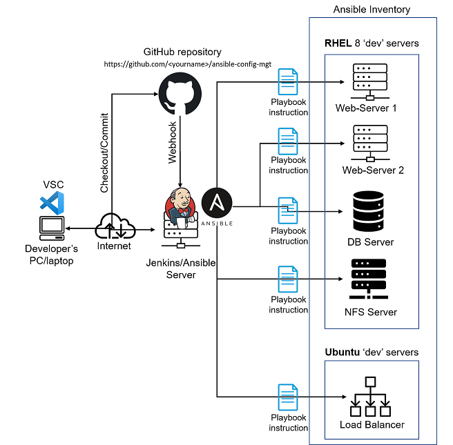

# AUTOMATING PROJECTS 7-10 USING ANSIBLE CONFIGURATION MANAGEMENT

In Projects 7-10, we had to perform lots of manual operations to set up virtual servers, install and configure required software,and deploy our web application.

We will automate the routine tasks with Ansible Configuration Management using declarative language such as `YAML`.

### ANSIBLE CLIENT AS A JUMP SERVER (BASTION HOST)

A **Jump Server(Bastion Host)** A bastion host is a special computer that plays the role of a gatekeeper between a device and your private network. Due to potential blocking of internet traffic by the internal network and hosted services, SSH may be the only means to access these services. In the current architecture we have been working on, the webservers are inside a secured network which cannot be reached directly from the Internet. To access the webservers using SSH, we need to go through a jump server which provides a better security and reduced attack. You can read more on a [Bastion Host](https://www.goodaccess.com/blog/what-is-a-bastion-host).

In the diagram below, the `Virtual Private Network (VPC)` is divided into two subnets – Public subnet has public IP addresses and Private subnet is only reachable by private IP addresses


We will be performing the following tasks:

- Install and configure Ansible client to act as a **Jump Server/Bastion** Host.
- Create a simple Ansible playbook to automate servers configuration.

### INSTALL AND CONFIGURE ANSIBLE ON EC2 INSTANCE

Update Name tag on your Jenkins EC2 Instance to Jenkins-Ansible. We will use this server to run playbooks.



In your GitHub account create a new repository and name it `ansible-config-mgt`.


**Install Ansible**
```
sudo apt update
sudo apt install ansible
```


### Jenkins configuration

Configure Jenkins build job to save your repository content every time you change it – this will solidify your Jenkins configuration skills acquired in [Project 9](https://github.com/Olaminiyi/Project-9).

Create a new Freestyle project ansible in Jenkins and point it to your `ansible-config-mgt` repository.
Configure Webhook in GitHub and set webhook to trigger ansible build.
Configure a Post-build job to save all (**) files, like you did it in [Project 9](https://github.com/Olaminiyi/Project-9).


Test your setup by making some change in `README.MD` file in master branch and make sure that builds starts automatically and Jenkins saves the files (build artifacts) in following folder

ls /var/lib/jenkins/jobs/ansible/builds/<build_number>/archive/


**Allocate an Elastic IP to your Jenkins-Ansible server** 


Clone down your ansible-config-mgt repo to your Jenkins-Ansible instance
```
git clone https://github.com/Olaminiyi/Ansible-Config.git
```


In your ansible-config-mgt GitHub repository, create a new branch that will be used for development of a new feature.


Checkout the newly created feature branch to your local machine and start building your code and directory structure

- Create a directory and name it playbooks – it will be used to store all your playbook files.
- Create a directory and name it inventory – it will be used to keep your hosts organised.
- Within the playbooks folder, create your first playbook, and name it common.yml
- Within the inventory folder, create an inventory file (.yml) for each environment (Development, Staging Testing and Production) dev, staging, uat, and prod respectively.


> [!NOTE]
> Ansible uses TCP port 22 by default, which means it needs to ssh into target servers from Jenkins-Ansible host – for this you can implement the concept of `ssh-agent`. Now you need to import your key into `ssh-agent`:
Exit from your ec2 user or ubuntu user(instance) to your local user i.e local directory that contains the `pem key file`
```
eval `ssh-agent -s`
```   
```   
ssh-add <path-to-private-key>(proj7_key.pem)
```
Confirm the key has been added with the command below, you should see the name of your key
```    
ssh-add -l
```
 
 
Then `ssh` into the ansible-jenkins instance with the public ip address directly from the local directory without using the normal amazon connection
``` 
ssh -A ubuntu@<public ip address>
```

    
Persist the key on the server 
```       
ssh-add -l
```
ssh into other instances from the ansible instance with there `private keys`
```  
ssh @ubuntu/ec2-user@<Private ip address>
```
   
 

Update your inventory/dev.yml file with this snippet of code:


Update your playbooks/common.yml file with following code:


Use git commands to add, commit and push your branch to GitHub.
```
git status
git add <selected files>
git commit -m "commit message"
```


Create a Pull request (PR)


Head back on your terminal, checkout from the feature branch into the master, and pull down the latest changes.
```
git checkout main
git status 
git pull  #this will update the master branch with what we have in pr-11 branch
```


Once your code changes appear in master branch – Jenkins will do its job and save all the files (build artifacts) to /var/lib/jenkins/jobs/ansible/builds/<build_number>/archive/ directory on Jenkins-Ansible server.


### Coonect to the server
ssh to your ansible-jenkins server with ssh ubuntu@<private ip address>
Navigate to where you have your project saved on the instance
```
cd /var/lib/jenkins/jobs/ansible/builds/4/archive
```

### Run the ansible-playbook
```
ansible-playbook -i inventory/dev.yml playbooks/common.yml
```   


You can go to each of the servers and check if wireshark has been installed by running which wireshark or wireshark --version
ssh to all the servers from the ansible-jenkins server and check if wireshark has been installed

ssh ubuntu/ec2-user@<private ip address>



> [!Note] 
> Ansible is Idempotent. Idempotency means that if an ansible playbook is run severally, it only makes the change to the server once unless there is a change in the playbook.

Now the updated architecture looks like this


